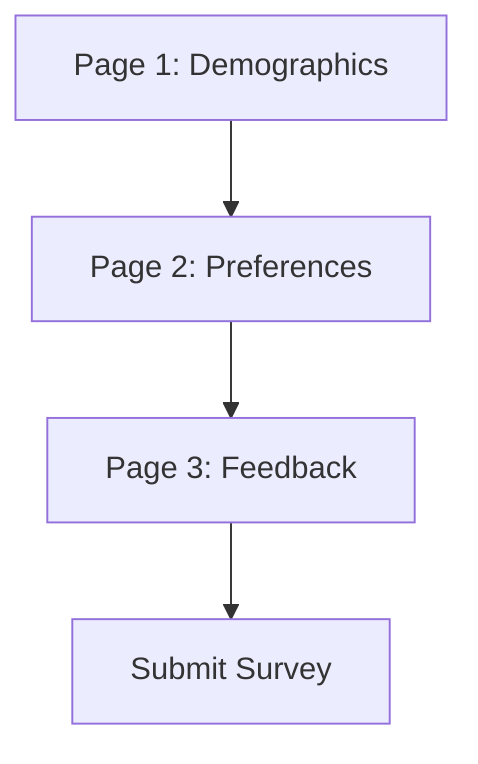

# 🎉 Pollcast User Guide: Your Opinion Matters! 🌟

Welcome to **Pollcast**, the super-powered polling and surveying app that makes collecting opinions as easy as pie (or should we say, as easy as clicking a button?). Whether you're a business guru, event organizer, or just curious about what your friends think about pineapple on pizza, Pollcast has got you covered!


---

## 📋 Table of Contents

1. [What's Pollcast?](#whats-pollcast)
2. [Getting Started](#getting-started)
3. [Creating Amazing Polls](#creating-amazing-polls)
4. [Building Detailed Surveys](#building-detailed-surveys)
5. [Participating Made Easy](#participating-made-easy)
6. [Analytics Dashboard Magic](#analytics-dashboard-magic)
7. [PWA Power-Up Features](#pwa-power-up-features)
8. [Automation and Smart Features](#automation-and-smart-features)
9. [API for Developers](#api-for-developers)
10. [Troubleshooting & FAQ](#troubleshooting--faq)

---

## ❓ What's Pollcast?

Pollcast is a comprehensive polling and surveying platform built on Frappe that lets you:

- 📊 **Create Polls**: Quick questions with multiple choices, ratings, or yes/no options
- 📝 **Build Surveys**: Multi-page detailed questionnaires with various question types
- 📈 **Real-time Analytics**: Live dashboards with charts, trends, and insights
- 📱 **PWA Ready**: Works offline, sends push notifications, installable on mobile
- 🤖 **Automation**: Auto-close expired polls, send reports, cleanup old data
- 🔄 **Live Updates**: See responses in real-time with Server-Sent Events

Perfect for feedback collection, event planning, market research, team decisions, and more!

---

## 🚀 Getting Started

### First Time Setup

1. Go to **Poll Manager** role
2. Create your first poll or survey
3. Set up email notifications (optional)
4. Configure automated reports (optional)

---

## 🎯 Creating Amazing Polls

### Basic Poll Creation

1. **Navigate to Polls**

   - Go to **Pollcast > Poll** in your desk
   - Click **New Poll**

2. **Fill in the Details**

   - **Title**: Something catchy like "What's your favorite ice cream flavor? 🍦"
   - **Description**: Add context or instructions
   - **Status**: Draft → Active when ready
   - **Dates**: Set start/end times (optional)

3. **Add Questions**

   - Click **Add Row** in the Questions table
   - Choose **Question Type**:
     - **Single Choice**: Radio buttons (one selection)
     - **Multiple Choice**: Checkboxes (multiple selections)
     - **Rating Scale**: 1-5 star rating

4. **Set Options**

   - For choice questions, enter options (one per line):
     ```
     Chocolate
     Vanilla
     Strawberry
     Mint Chocolate Chip
     ```

5. **Save and Share**
   - Save your poll
   - Copy the **Shareable Link** to distribute

### Advanced Poll Features

- **Multiple Selections**: Enable for multiple choice questions
- **Date Restrictions**: Schedule when polls open/close
- **Auto-close**: Polls automatically close at end date
- **Analytics**: View real-time results and trends

**Pro Tip**: Use emojis in options to make polls more engaging! 🎉✨

---

## 📝 Building Detailed Surveys

### Survey Creation Basics

1. **Create New Survey**

   - **Pollcast > Survey > New Survey**
   - Fill title and description

2. **Choose Survey Type**

   - **Multi-page**: Split into sections with progress bar
   - **Single page**: All questions on one page

3. **Add Questions**

   - Click **Add Row** in Questions table
   - Choose from question types:
     - **Multiple Choice**: Radio buttons
     - **Checkbox**: Multiple selections allowed
     - **Rating Scale**: 1-5 (or custom range)
     - **Text Input**: Open-ended responses

4. **Configure Questions**
   - **Required**: Make question mandatory
   - **Page Number**: For multi-page surveys
   - **Scale Min/Max**: For rating questions

### Multi-Page Survey Magic



**Benefits:**

- 🎯 Better completion rates
- 📊 Clear progress indication
- 🔄 Easy navigation (Previous/Next)
- 📱 Mobile-friendly pagination

### Survey Best Practices

- **Keep it Short**: Aim for 5-10 questions
- **Logical Flow**: Group related questions
- **Required Fields**: Only mark essential questions as required
- **Mobile Testing**: Check on phones/tablets
- **Clear Instructions**: Explain rating scales

---

## 👥 Participating Made Easy

### Taking a Poll

1. **Receive Link**: Get the poll's shareable link
2. **Open in Browser**: Works on any device
3. **Select Options**: Click your choice(s)
4. **Submit**: Hit the submit button
5. **View Results**: Optional next step

**Features:**

- 📱 Responsive design
- ⚡ Fast loading
- 🔒 Anonymous participation
- 📊 Real-time feedback
- 🔔 Success notifications

### Completing a Survey

1. **Access Survey**: Click the survey link
2. **Fill Questions**: Answer each question
3. **Navigate Pages**: Use Previous/Next buttons
4. **Review**: Check required fields before submit
5. **Submit**: Send your responses

**Smart Features:**

- 💾 Auto-save progress (coming soon)
- 📶 Offline support via PWA
- ⏰ Session recovery
- 🎯 Progress tracking
- ✅ Validation messages

---

## 📊 Analytics Dashboard Magic

### Dashboard Overview

Access via `{{ base_url }}/analytics-dashboard.html`

**Key Metrics:**

- 📈 **Active Polls/Surveys**: Current running count
- 👥 **Total Responses**: All-time participation
- 🚀 **Engagement Rate**: Response percentage
- 📉 **Trend Indicators**: Week-over-week changes

### Real-time Updates

- **Live Connection**: See connection status indicator
- **Auto-refresh**: Toggle for automatic updates
- **SSE Integration**: Server-sent events for instant updates
- **Push Notifications**: New response alerts

### Charts and Visualizations

1. **Response Timeline**

   - View responses over time
   - Filter by 24h, 7d, 30d
   - Interactive Chart.js graphs

2. **Top Performing Content**

   - Bar charts of most popular polls
   - Engagement metrics
   - Click to drill down

3. **Detailed Analytics**
   - **Poll Analytics**: Option percentages, vote counts
   - **Survey Analytics**: Question breakdowns, completion rates
   - **Text Responses**: Sample answers (first few)
   - **Rating Distributions**: Average scores, distributions

### Export Options

- **CSV Export**: Raw data for analysis
- **Excel Format**: Spreadsheet-ready
- **PDF Reports**: Professional summaries
- **Custom Filters**: Include/exclude specific data

---

## 📱 PWA Power-Up Features

### Install Pollcast

1. **Browser Prompt**: Click "Install" when prompted
2. **Manual Install**: Chrome menu > Install Pollcast
3. **Home Screen**: Add to mobile home screen

### Offline Capabilities

- **Cache First**: Static assets load instantly
- **Background Sync**: Submit responses when back online
- **Offline Page**: Graceful degradation
- **Service Worker**: Smart caching strategies

### Push Notifications

- **New Polls**: Get notified of new polls to take
- **Survey Reminders**: Gentle nudges for incomplete surveys
- **Results Available**: When poll/survey results are ready
- **System Updates**: Maintenance notifications

**Notification Settings:**

- Enable/disable in browser
- Custom notification preferences
- Do Not Disturb modes

---

## 🤖 Automation and Smart Features

### Scheduled Tasks

**Hourly:**

- Analytics cache refresh
- Connection health checks

**Daily:**

- Old response cleanup (retention policy)
- Report generation
- System maintenance

**Weekly:**

- Trending analysis
- Performance optimization

### Email Automation

1. **Scheduled Reports**

   - Daily/Weekly/Monthly summaries
   - Custom recipient lists
   - PDF/Excel attachments

2. **Response Notifications**

   - Alert creators of new responses
   - Configurable thresholds
   - Smart spam prevention

3. **Auto-close Alerts**
   - Notify when polls/surveys expire
   - Reminder emails before expiration

### Background Jobs

- **Job Logging**: Track all automated tasks
- **Error Handling**: Failed job retries
- **Performance Monitoring**: Job execution times
- **Manual Triggers**: Run jobs on-demand

---

## 🆘 Troubleshooting & FAQ

### Common Issues

**Q: Poll/Survey not loading?**
A: Check shareable link format and status (Active). Ensure dates are valid.

**Q: Responses not appearing in analytics?**
A: Check database connections and background job status. Try manual refresh.

**Q: PWA not installing?**
A: Ensure HTTPS in production. Check browser compatibility.

**Q: Email reports not sending?**
A: Verify SMTP settings. Check spam folder.

## 🎊 Conclusion

Pollcast is more than just a polling app—it's your opinion collection superpower! With real-time analytics, PWA capabilities, and smart automation, you can gather insights faster and more effectively than ever before.

Ready to start collecting amazing opinions? Create your first poll now! 🚀

**Happy Polling! 📊✨**

---

_Pollcast v1.0.0 - Built with ❤️ using Frappe Framework_
